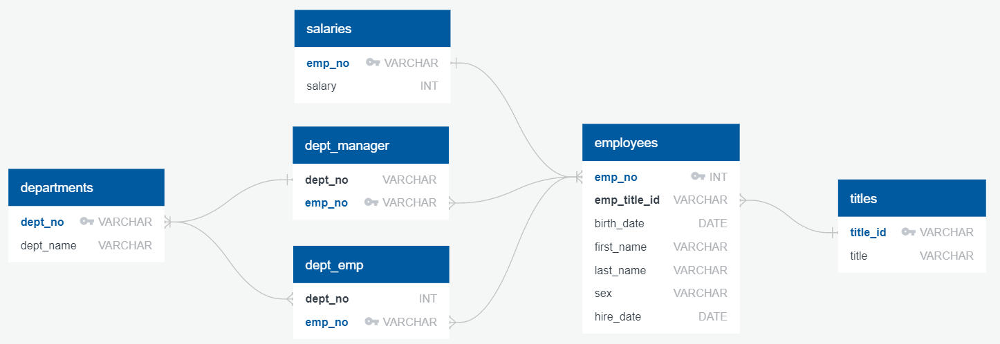

# Entity Relational Diagram 

[Quick Database Diagrams](https://www.quickdatabasediagrams.com/) was used to create the diagram. 

## Written Discription 

A diagram displaying the relationship between the six tables within the [resources](https://github.com/presitkaur/sql-challenge/tree/main/Resources) folder of this repository. It displays the primary and foreign keys of the tables and how tables may be connected to each other. 

For information on what primary and foregin keys are, refer to [this](https://macxima.medium.com/primary-key-vs-foreign-key-in-sql-d89260b74e1c) article. 

Click [here](https://github.com/presitkaur/sql-challenge) to return to the main page 